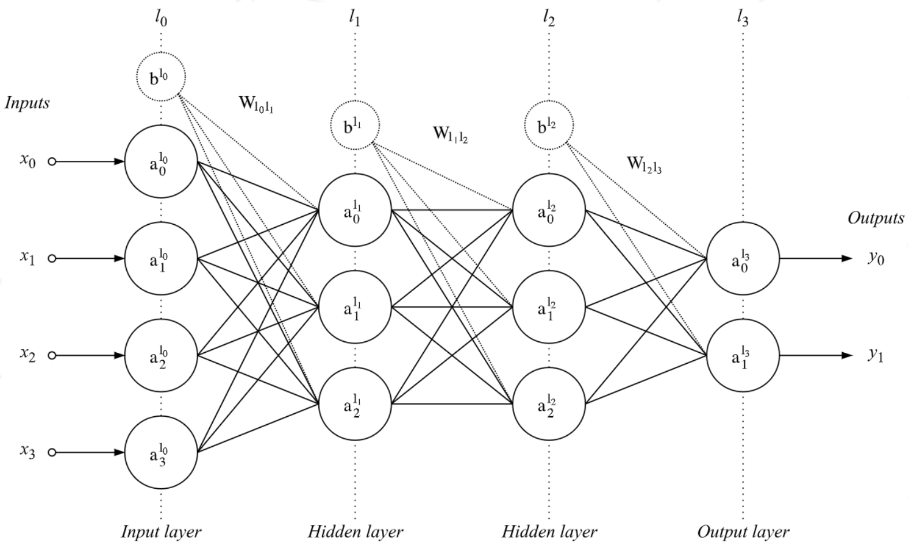
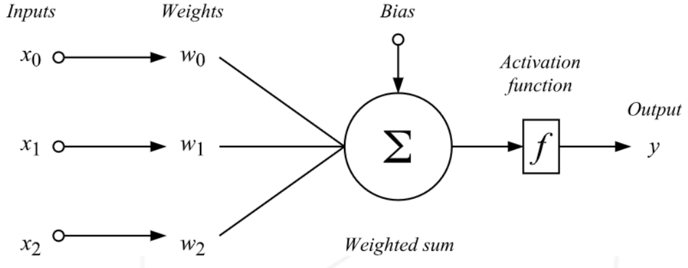
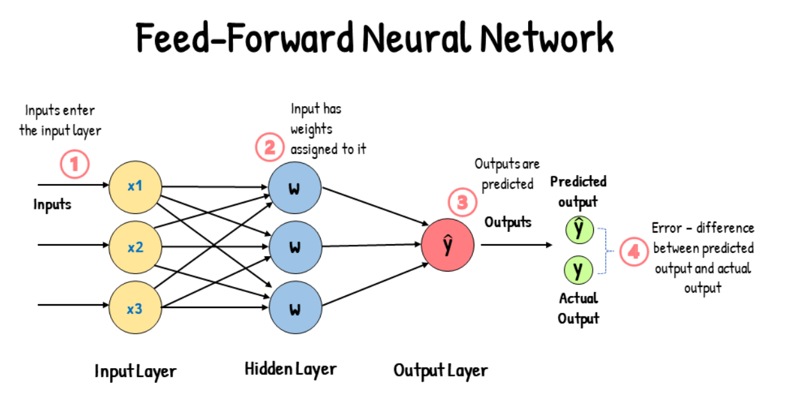
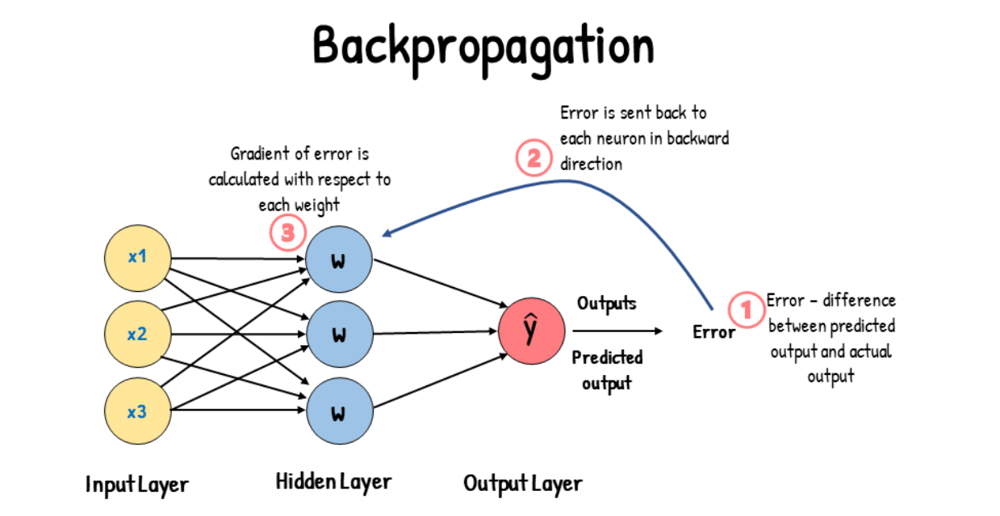
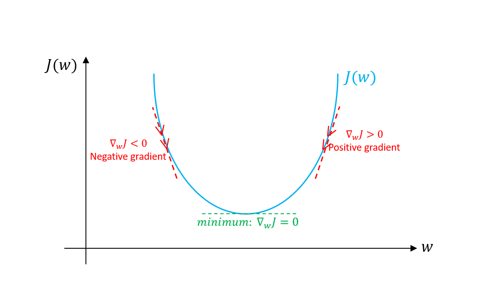
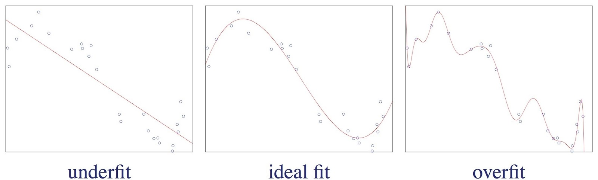
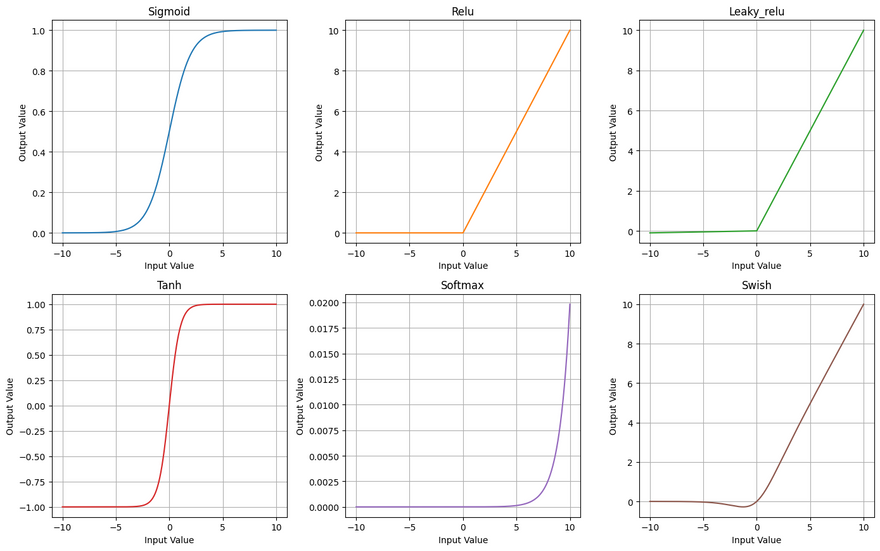
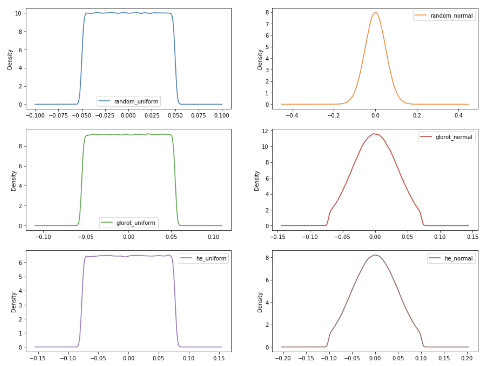

# 42_multilayer-perceptron_artificial_neural_network

## Multilayer Perceptron (MLP)

A Multilayer Perceptron is a type of artificial neural network where neurons are organized in multiple layers:

- Input Layer: Receives the raw data
- Hidden Layer(s): Processes the information
- Output Layer: Produces the final prediction

Key features:

- Each neuron connects to every neuron in the next layer (fully connected)
- Uses activation functions to introduce non-linearity
- Learns through backpropagation and gradient descent
- Can solve complex, non-linear problems

**Basic Neuron Structure**:

Input → Weight → Sum → Activation Function → Output

(X) → (W) → (Z = W·X + b) → f(Z) → (A)

## Global Process to Train a Neural Network

Here's a comprehensive step-by-step guide to training a neural network:

1. **Initialize Network Architecture**
   - Define layer sizes (input, hidden, output)
   - Initialize weights using selected method (Random, HeNormal, GlorotUniform, etc.)
   - Initialize biases (typically with zeros)

2. **Data Preparation**
   - Convert input data to numpy arrays
   - Shape training data (m samples × n features)
   - Shape labels appropriately
   - Split data into batches if using mini-batch training

3. **Feed Forward Propagation**
   - For each layer:
     - Compute linear transformation: Z = W × A + b
     - Apply activation function: A = f(Z)
   - Store activations for backpropagation
   - Apply softmax at output layer

4. **Loss Computation**
   - Calculate loss between predicted and actual values
   - Common loss functions: binary cross-entropy, MSE, etc.

5. **Backpropagation**
   - Calculate initial error gradient at output layer
   - For each layer (from last to first):
     - Compute gradients for weights (dW)
     - Compute gradients for biases (db)
     - Propagate error to previous layer
     - Apply gradient clipping to prevent explosion

6. **Parameter Update**
   - Use selected optimizer (GD, SGD, Momentum)
   - Update weights: W = W - learning_rate * dW
   - Update biases: b = b - learning_rate * db

7. **Training Loop**
   - Repeat steps 3-6 for each batch
   - Complete epochs
   - Track metrics (loss, accuracy)
   - Apply early stopping if configured

8. **Validation**
   - Evaluate model on validation set
   - Calculate validation metrics
   - Save best model if using early stopping

9. **Model Evaluation**
   - Make final predictions
   - Calculate final metrics
   - Return trained weights and performance history

This process is iterative and continues until either:
- The maximum number of epochs is reached
- Early stopping criteria are met
- Desired performance is achieved

[Learn More: Explicando la Matemática de como las Redes Neuronales Aprenden](https://medium.com/latinxinai/un-lego-a-la-vez-explicando-la-matem%C3%A1tica-de-como-las-redes-neuronales-aprenden-ae582ab91da6)

[Learn More: Matrices para Redes Neuronales](https://blog.tenea.com/matrices-redes-neuronales/)

## Documentation

### *Feedforward*:

Input data flows through the network in one direction (forward).

Each layer processes data sequentially:
1. **Weighted Sum**: Calculate the weighted sum of inputs and add the bias.
2. **Activation Function**: Apply an activation function (e.g., sigmoid) to introduce non-linearity.
3. **Output**: Pass the result to the next layer.

There are no loops or cycles; data moves strictly in the direction of input → hidden → output layers.

### *Backpropagation*:

An algorithm used to calculate gradients for network training.

**Steps**:
1. **Output Error**: Compute the error at the output layer (e.g., difference between predicted and actual values).
2. **Backward Propagation**:
   - Propagate the error backward through the network using the chain rule.
   - Calculate local gradients for each layer.
3. **Gradients**:
   - Compute partial derivatives of the error with respect to weights and biases.

**Key formula**:
$$
{\text{Error Gradient} = \text{Local Gradient} \times \text{Downstream Gradient}}
$$

### *Gradient Descent*:

Gradient descent is an optimization algorithm used to minimize the network's error (loss) by iteratively adjusting the model's parameters (weights and biases).

How it works:

- Calculates the gradient (slope) of the loss function with respect to each parameter

- Updates parameters in the opposite direction of the gradient

- The learning rate controls how big each adjustment step is

**Steps**:
1. **Calculate Error Gradients**: Use backpropagation to compute gradients.
2. **Update Parameters**: Adjust weights and biases in the direction opposite to the gradient.
3. **Learning Rate**: Controls the step size for updates.

**Variants**:
- **Mini-batch Gradient Descent**: Updates weights using a small random subset of the data instead of the entire dataset.

### *Interplay Between the Three Processes*:
1. Perform feedforward to generate predictions.
2. Use backpropagation to compute gradients based on the predictions.
3. Apply gradient descent to update the weights and biases.
4. Repeat until the model converges (i.e., achieves minimal error).

### *Overfitting*:

Overfitting occurs when a model learns noise or random fluctuations in the training data instead of the underlying patterns, leading to poor generalization on unseen data.

**Methods to Avoid Overfitting**:
- **Regularization**: Add a penalty term to the loss function (e.g., L1 or L2 regularization).
- **Dropout**: Randomly disable neurons during training to prevent reliance on specific features.
- **Data Augmentation**: Increase dataset size by transforming the data (e.g., rotations, scaling).
- **Early Stopping**: Halt training when performance on a validation set starts to deteriorate.
- **Cross-Validation**: Use techniques like k-fold cross-validation to ensure robustness.

### *Activation Functions*:

Activation functions introduce non-linearities into the model, enabling it to learn complex patterns.

**Common Types**:
1. **Sigmoid**:
   - Squashes inputs into a range between 0 and 1.
   - Commonly used in binary classification.
   - Formula:
$$
{\sigma(x) = \frac{1}{1 + e^{-x}}}
$$

2. **Tanh**:
   - Squashes inputs into a range between -1 and 1.
   - Centered around zero, often preferred over sigmoid.
   - Formula:
$$
{\text{Tanh}(x) = \frac{e^{x} - e^{-x}}{e^{x} + e^{-x}}}
$$

3. **ReLU** (Rectified Linear Unit):
   - Outputs positive signals and zero for negative inputs.
   - Monotonic derivative; computationally efficient.
   - Formula:
$$
{\displaystyle ReLU = {\begin{aligned}&{\begin{cases}0&{\text{if }}x\leq 0\\x&{\text{if }}x>0\end{cases}}=&\max\{0,x\}\end{aligned}}}
$$

4. **Leaky ReLU**:
   - Similar to ReLU but allows a small gradient for negative inputs.
   - Formula:
$$
{\text{Leaky ReLU}(x) = \begin{cases} x & \text{if } x > 0 \\ \alpha x & \text{if } x \leq 0 \end{cases}}
$$
where $\alpha$ is a small constant (e.g., 0.01).

5. **Softmax**:
   - Converts outputs into probabilities.
   - Commonly used in multi-class classification.
   - Formula:
$$
{\text{Softmax}(x_i) = \frac{e^{x_i}}{\sum_{j} e^{x_j}}}
$$

<!--  -->

[Learn More: Activation Functions](https://medium.com/@cmukesh8688/activation-functions-sigmoid-tanh-relu-leaky-relu-softmax-50d3778dcea5)

### *Binary cross-entropy error function*

Binary Cross-Entropy (BCE) is a loss function commonly used in binary classification problems, where the task is to classify data into one of two classes (e.g., 0 or 1).

Key Points:
- Penalty for Wrong Predictions: The function heavily penalizes predictions that are confident but incorrect.
- Logarithmic Nature: The use of the logarithm emphasizes small differences when the prediction is close to the true label and larger differences when predictions are far off.
- Interpretation: BCE is minimized when the predicted probabilities align closely with the true labels, making it an effective metric for binary classification.

### *Weights initialization*

Selection guide:

- Random: Not recommended for deep networks.
- Use He initialization for ReLU networks
- Use Glorot/Xavier for sigmoid/tanh networks
- Normal distributions often work better for larger networks
- Uniform distributions can be more stable for smaller networks
